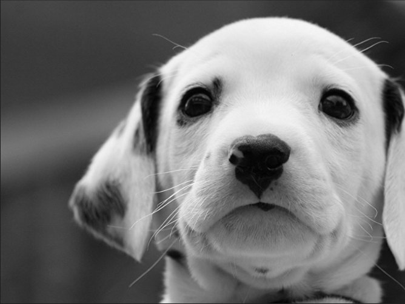

# Imagem ASCII

Este projeto consiste no trabalho 1 da disciplina de Processamento de Imagens. 

## Objetivo

Transformar uma imagem de tons de conza do tipo .PGM em uma imagem caracteres ASCII de acordo com a os caracteres informados.

[Descrição completa do trabalho](Descricao_Atividade1.pdf)

## Requisitos
 - Linux ou WLS
 - make
 - Java 17

## Como executar

Este programa é executado por linha de comando e é passado como parâmetro o nome do arquivo esteganografado sem a extensao <.PPM>  

### 1) Compile o programa

```
    make
```

### 2) Execute o comando

```
    java Main <nome_arquivo_imagem> <número_colunas> <número_linhas> <caracteres_ascii>
```

### Exemplo:

```
    java Main "img/cao" 100 30 "@$#*%o!=+;:~-,. "
```

- Imagem original:

    

- Imagem ASCII:

    